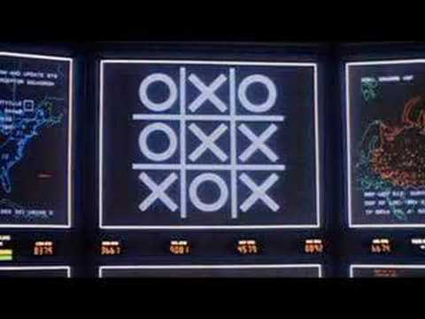

# Terraform Puzzle #1
## Shall We Play a Game?
**Challenge Level: Intermediate**

### Background
🚀 You're working at a high security government facility. Due to a recent security breach you need to customize the login banner on the mainframe, also known as the WOPR.

## The Challenge
In this challenge you'll use the [local_file](https://www.terraform.io/docs/providers/local/r/file.html) resource to render a new **/etc/motd** (Message of the Day) file.

Create a file called `main.tf` and use a [local_file](https://www.terraform.io/docs/providers/local/r/file.html) resource to render the **/etc/motd** file with your custom warning message. You'll need to replace the `warning` variable in the template with your own warning message. You can use the included `banner.tpl` file as your template source.