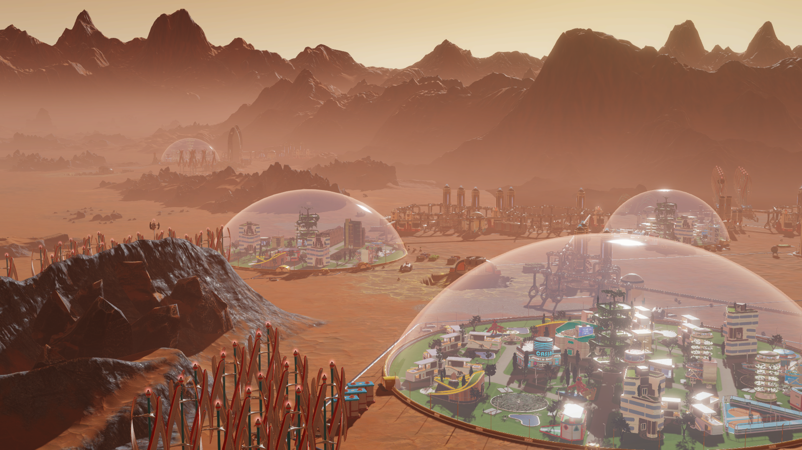

# Terraform Puzzle #3
## Space - The Final Frontier
**Challenge Level: Advanced**

It's 2120 and the Mars Colony project is progressing nicely. As a senior sysadmin working out of Mariner Valley your job is to provision fuel supplies for the various colonies and bases.

In this challenge you'll bring external data sources into your terraform run.

Use the `mars_weather.sh` script along with an [External Data Source](https://www.terraform.io/docs/providers/external/data_source.html) and a [Null Resource](https://www.terraform.io/docs/provisioners/null_resource.html) to fetch the most recent weather forecast from NASA's [Insight Weather Station](https://mars.nasa.gov/insight/weather/) at Elysium Planitia.

Your terraform code can all go into a single file, main.tf. It should output the most recent minimum and maximum temperature from Elysium Planitia.