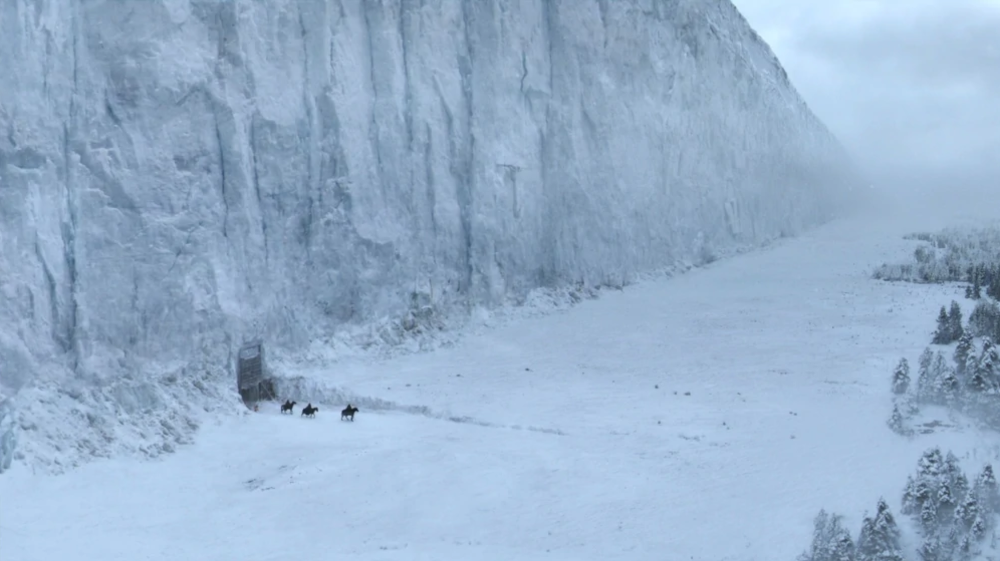

# Terraform Puzzle #4
## Winter is Coming
**Challenge Level: Intermediate**

### Background
🐺 You're the lead devops admin at a used book store. You need a data source to help categorize some of the books and comics in the fantasy section. Data sources allow you to bring useful data into your terraform runs.

### The Challenge
Create a file called `main.tf` and use the [HTTP Data Source](https://www.terraform.io/docs/providers/http/data_source.html) to query the [API of Ice and Fire](https://anapioficeandfire.com) and fetch character profile [#583](https://anapioficeandfire.com/api/characters/583). Then use a [null resource](https://www.terraform.io/docs/provisioners/null_resource.html) with a [local_exec](https://www.terraform.io/docs/provisioners/local-exec.html) provisioner to echo out the character's name in your quote.

You should also create an output showing the character's name that you got from the API of Ice and Fire.

HINT: The [jsondecode](https://www.terraform.io/docs/configuration/functions/jsondecode.html) function can help you parse the results you receive from the HTTP data source.